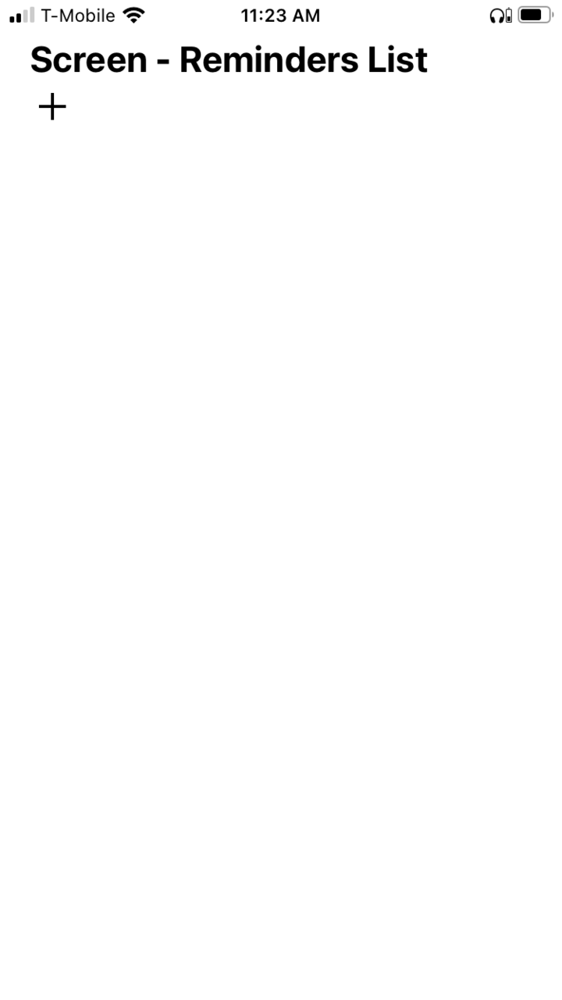
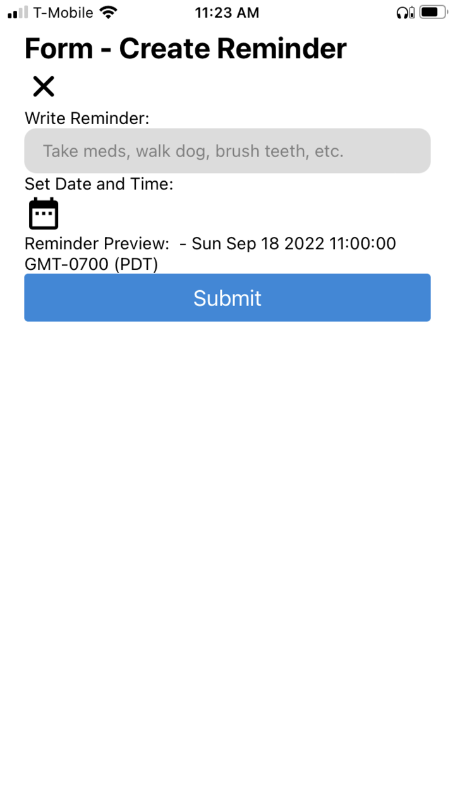
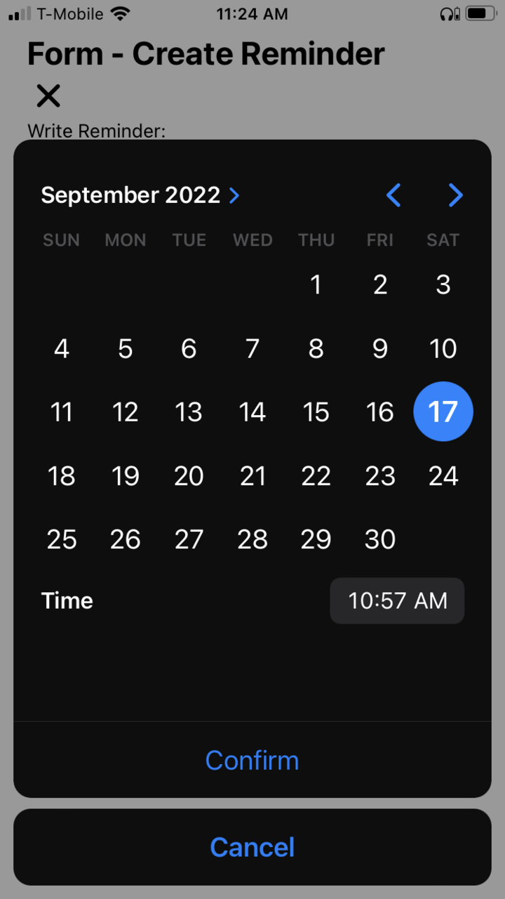
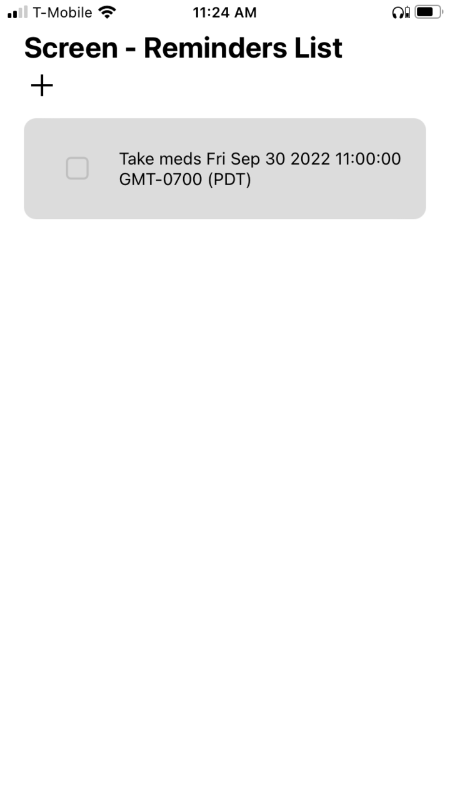
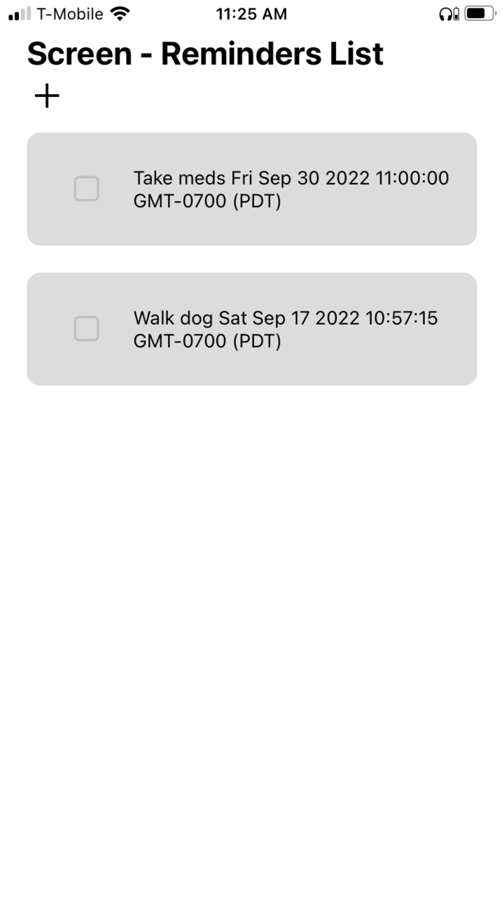
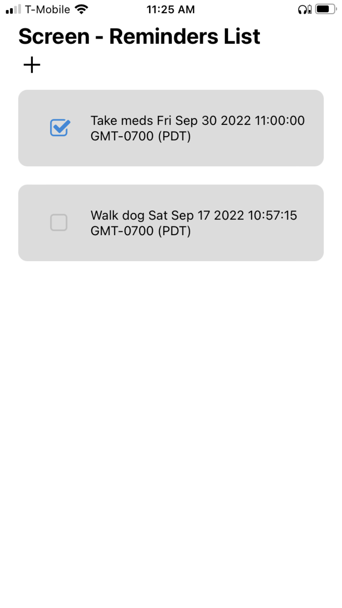
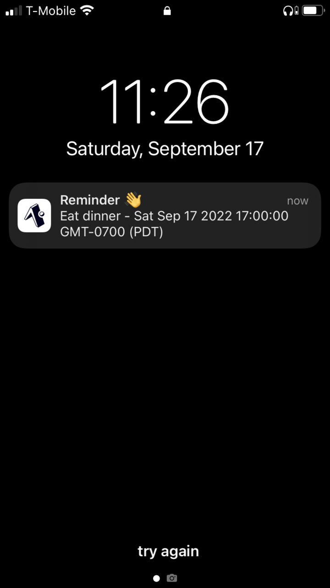

# React Native Reminder App
## _My First React Native Project_

A React Native CRUD application with a simple reminder form and screen. Instructions to view and interact with the current project version can be found below.

## Technology Stack

- React
- JavaScript
- React Native

## Disclaimers
- No Backend.
- Frontend only.
- No data storage.
- Designed on iPhone.
- Data does not persist.
- Minimal Android design time.

## Features

- A user can create a reminder.
- A user can see when they will be reminded.
- A user can set a reminder to complete in that list.
- A user can see a list of all the reminders they have created.
- A user will receive a local notification five seconds after reminder creation outside of App foreground as a proof of concept reminder notification.

## Summary

This application was built as a code challenge, and is my first foray into React Native. I utilized [Expo Go Quickstart](https://reactnative.dev/docs/environment-setup) within the official [React Native Documentation](https://reactnative.dev/docs/getting-started) and read through all visibly pertinent material. Afterwards I read through all pertinent [Expo Documentation](https://docs.expo.dev/get-started/create-a-new-app/) since I decided to leverage it.

##### Expected Behavior
- To add a reminder press the plus icon/button in the upper left hand corner. Doing so will pull up the create reminder form.
- To exit the create reminder form press the x icon/button in the upper left hand corner.
- To create a reminder navigate to the create reminder form, type your reminder in the "Write Reminder" text input field, and press the calendar button/icon to set a date and time. After completion press the submit button. Your newly created reminder should appear on the reminders list screen.
- To mark a reminder as complete tap the square and a check will appear to mark it as complete.
- To delete a reminder tap on the reminder itself.
- To see the reminder notification that is automatically set upon reminder creation you must be outside the app itself. The notification will appear with the title 'Reminder' and the reminder text and scheduled date/time as a string.
- Reminder notifications are not tied to the actual date/time itself currently, as the current notification function is a proof of concept.

##### Example Project Screenshots

1. Screen - Reminders List

2. Form - Create Reminder

3. Schedule Reminder Modal

4. Created Reminder

5. Multiple Reminders

6. Completed Reminder

7. Local Notification

## Bugs

#### Android OS
- Attempting to schedule the date/time of reminders force closes the application. This behavior was recently reported in the [react-native-modal-datetime-picker](https://github.com/mmazzarolo/react-native-modal-datetime-picker) repository, to which [I also reported](https://github.com/mmazzarolo/react-native-modal-datetime-picker/issues/662) the same behavior in this project since it utilizes it.
- UI/UX on some phones overtakes status bar.
- UI/UX on app overtakes some phone status bars.

#### Form - Create Reminder
- Reminder Preview section shows undefined when app initially loads or is reloaded.

#### Screen - Reminders List
- Reminders with completion checkmarks inherit lack of checkmark from above non-completed reminders when deleted.
- Reminders spill off the lower half of the screen and are not scrollable currently.

#### Local Notifications
- Local non-app foreground notifications appear on utilized iPhone for development, but not on other iPhones. I have pinpointed it to be due to Apple permissions. Expo-permissions has been recently deprecated and I am learning to implement its replacement.

## How to View and Interact with this project

To view and interact with this project follow the steps below:

1. Navigate to this link that takes you to an Expo Snack of this project: https://snack.expo.dev/@justicepelteir/mvpreactnativereminderapp
2. You can either elect to interact with the app by choosing option one "Run on your device" or two "Show embeded code" option that can be found in the navigation bar.
3. Option one will require you to download Expo Go on your cellphone.
4. Option two only requires a computer and for you to select how you would like to view/interact with it.
5. For more detailed instructions on navigating Expo Snacks click the following link for the [official snack documentation](https://docs.expo.dev/workflow/snack/).

## License

MIT